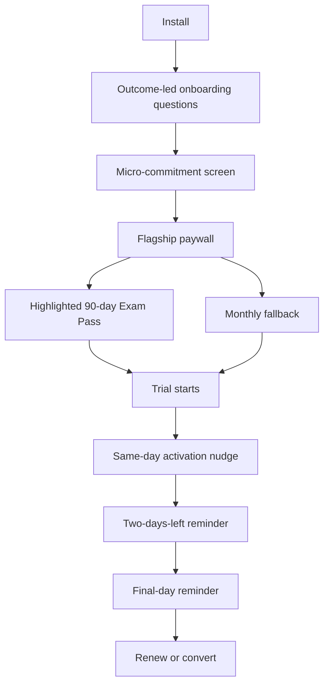
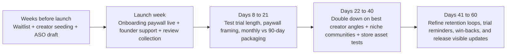

# SOURCE — ChatGPT Deep Research, 2026-08-01

> **This is a raw research output, archived verbatim. Do not edit it to reflect new
> findings.** Corrections and interpretation belong in
> [`../RevenueCat_Benchmarks_2026.md`](../RevenueCat_Benchmarks_2026.md), which is derived
> from this file. Source data is never overwritten when newer data arrives.
>
> | | |
> |---|---|
> | **Tool** | ChatGPT Deep Research |
> | **Received** | 2026-08-01 |
> | **Original filename** | `deep-research-report (2).md` |
> | **Prompt (reconstructed)** | RevenueCat growth playbook for launching a subscription **exam-prep** app in 60 days; geography, platform and renewal model all unfixed; flagship considered as $79.99 / 90-day |
> | **Run** | 2 of 2. Run 1 (2026-07-28) produced `RevenueCat_Growth_Playbook.md` from the same prompt. |
> | **Derived into** | `RevenueCat_Benchmarks_2026.md` (2026-08-01) |
>
> ### Two defects in the delivered file, recorded rather than hidden
>
> 1. **Citation markers are corrupted.** Every inline citation arrived as a mangled token —
>    `îciteîturn22view8îturn27view4î` and similar — with no resolvable URL. They are
>    preserved below exactly as received. **No figure in this document can be traced to its
>    RevenueCat source page.** Anything appearing ONLY here and not in run 1 is therefore
>    unverified; the derived file lists exactly which figures those are.
> 2. **UTF-8 mojibake was repaired.** The file arrived with smart quotes, apostrophes and
>    em-dashes double-encoded (`’`, `“`, `â€"`). Those are a transport encoding fault,
>    not content, and have been restored to the intended characters. **No wording was
>    changed.** If you need the byte-exact original, it is the file the owner pasted into
>    the 2026-08-01 session.
>
> ### Known gap
>
> **Run 1's raw output was never archived.** `RevenueCat_Growth_Playbook.md` is a distilled
> product of a 2026-07-28 research run whose source document does not exist in this repo.
> Its numbers cannot be re-checked against a source either. If that original is still
> recoverable, it belongs beside this file as `2026-07-28-*`.

---

# RevenueCat Growth Playbook for Launching a Subscription Exam Prep App in Sixty Days

## Executive summary

This report assumes three things from your prompt: geography is not yet fixed, platform is not yet fixed, and the flagship ninety-day product could end up being either auto-renewing or fixed-term/non-renewing. Because of that, the safest way to use RevenueCat's published guidance is to treat its global and category benchmarks as the baseline, then bias decisions toward the patterns that RevenueCat says work best for **goal-oriented**, **new-brand**, and **short-horizon** subscription products. îciteîturn22view8îturn27view4îturn14view5î

The core strategic conclusion is straightforward: your app should not behave like a generic "learn forever" education subscription. RevenueCat's 2026 data says Education apps command the **highest yearly category median price at $44.99** and a **top-tier monthly median at $9.99**, but RevenueCat's renewal benchmarks also show Education is unusually **weak on annual renewals at 24%** and relatively **strong on short-cycle renewals** at **56% monthly** and **58% weekly**. RevenueCat explicitly interprets that pattern as evidence that Education works best when the plan duration matches the user's goal window, such as a semester or a language-learning sprint. For an exam-prep product, that argues for a **time-boxed "exam season" offer** rather than a "subscribe for a year" mindset. îciteîturn23view5îturn27view0îturn27view2îturn27view3îturn27view4î

That same logic is why your current draft offer needs careful packaging. A **$79.99 / 90-day** product is materially above RevenueCat's published Education category medians. That does not make it wrong, but it does mean it should be sold as a **premium transformation offer** with strong outcome framing, not as a plain content-access subscription. RevenueCat's broader 2026 data shows higher-priced apps can drive much stronger payer value, but they also carry higher refund rates. In other words: premium can work, but only if trust and perceived value are equally premium. îciteîturn22view8îturn35view4îturn9view5î

On monetization model, RevenueCat's strongest benchmark is that **hard paywalls convert far better than freemium** in the first five weeks: **10.7% median D35 download-to-paid** for hard paywalls versus **2.1%** for freemium. For a new exam-prep app with no established viral loop and a short-value window, that strongly favors a **hard or near-hard paywall** with a small amount of controlled previewing, not an expansive freemium tier. RevenueCat does show softer models can work when the free product is itself the growth engine, but that is a very different business from the one you are describing. îciteîturn7view2îturn7view3îturn8view2îturn31view0î

On trials, RevenueCat's answer is nuanced. Aggregate 2026 benchmarks show **longer trials convert better** than shorter ones: **25.5%** median trial-to-paid for trials of **four days or less**, **37.4%** for **five to nine days**, and **42.5%** for **seventeen to thirty-two days**. But RevenueCat's more tactical guidance says trial length should match **usage cadence and time-to-value**, not a generic benchmark. For **daily-use habit products**, RevenueCat recommends **seven to fourteen days** as the default design space, while warning that fourteen-day tests can lose to seven-day tests if users simply procrastinate instead of activating. That makes a **seven-day starting point** the most defensible launch choice for your app. îciteîturn7view5îturn7view6îturn7view7îturn10view3îturn10view5î

Finally, the first two months should be run as a tight learning loop, not a static launch. RevenueCat repeatedly emphasizes that early wins come from **onboarding and activation**, not from chasing acquisition volume first. In subscription apps, **over 80% of trials start immediately after install**, nearly all trial starts happen on **Day 0**, and RevenueCat's early-stage framework says you should prioritize **time to first value**, **time to core value**, **download-to-trial**, **trial-to-paid**, **download-to-paid**, and **revenue per install** before you worry about scaling spend. îciteîturn16view0îturn25view5îturn17view0îturn17view1îturn17view9î

## Pricing

The most important pricing fact in RevenueCat's 2026 benchmark set is that Education is a **premium category** by mobile subscription standards: **$9.99** is the category-leading monthly median and **$44.99** is the category-leading yearly median. At the same time, RevenueCat's renewal data says Education users are unusually resistant to long commitments, with only **24% median first annual renewal**, versus **56% for monthly** and **58% for weekly**. RevenueCat's interpretation is that Education users often buy around a concrete goal and prefer plan lengths that match that goal. For an exam-prep app, that makes a goal-matched fixed term much more natural than a generic annual subscription. îciteîturn22view8îturn22view1îturn27view0îturn27view2îturn27view3îturn27view4î

RevenueCat's newer packaging guidance pushes in the same direction. In its 2026 article on when monthly plans are best, RevenueCat argues monthly plans are especially strong when a brand is new, trust is still being built, and the user's expected use case has a **natural endpoint within three to six months**. RevenueCat explicitly says that, in those cases, a monthly or quarterly structure may serve both the app and the user better than forcing an annual commitment. That is almost a direct description of exam preparation. îciteîturn14view5îturn14view6îturn14view7î

That is why your proposed **$79.99 / 90-day** product should be treated as a **positioning decision**, not just a price point. Against RevenueCat's benchmarks, it is not a standard Education offer; it is a premium-plus offer. RevenueCat's state report shows higher-priced apps generate much higher realized payer value than low-priced apps, but it also shows premium pricing increases refund rates from a **2.7% median** for low-priced apps to **4.5%** for high-priced apps. So the question is not "Can you charge $79.99?" The question is "What premium proof will make $79.99 feel deserved?" îciteîturn35view4îturn9view5î

RevenueCat's published psychology and paywall-testing guidance gives you the playbook for that proof. First, **anchor against something higher or longer**: RevenueCat defines anchoring as showing a higher-priced context so the target offer feels more reasonable. Second, **frame large prices as smaller units**, such as translating annual billing into a monthly equivalent. RevenueCat cites Mojo's experiment where expressing annual billing as a monthly equivalent increased revenue per paywall impression, and the 2026 State report includes a regional example where framing a yearly plan as "just $X per month" increased trial starts by **30%** and yearly take rate by **10%** with no penalty to trial-to-paid conversion. îciteîturn32view0îturn32view3îturn32view4îturn13view0îturn25view3î

For your app, that means the decision is less about "3 months vs monthly" and more about **what is being sold**:

| Packaging option | RevenueCat reading of the pattern | Best interpretation for your app |
|---|---|---|
| **Monthly fallback only** | Best for new brands, low trust, and three-to-six-month use cases. Education users renew monthly far better than annually. | Strongest low-risk launch option if you want maximum learning speed. |
| **Ninety-day exam pass** | RevenueCat has no dedicated quarterly Education benchmark, but its goal-matching logic strongly supports fixed-term offers for short-horizon education use cases. | Best if the product is explicitly sold as an exam-season transformation offer. |
| **Annual first** | Education annual pricing is high, but annual renewal is weak at 24%. | Poor fit for your first launch unless your product is broader than exam prep. |

The one-time/period-pass question matters here. RevenueCat's own platform guidance distinguishes **auto-renewable subscriptions** from **non-renewing / prepaid limited-time access**. On iOS, RevenueCat describes non-renewing subscriptions as limited-time access without automatic renewal. On Google Play, RevenueCat's prepaid-plan docs explain that prepaid subscribers must manually extend or "top up" access, and RevenueCat notes that prepaid structures are especially relevant in markets where auto-renewing subscriptions are constrained or less preferred. For a time-boxed exam product, that makes a fixed-term pass strategically coherent, especially if you want the user to feel they are buying an "exam season" rather than signing an indefinite billing contract. îciteîturn21view2îturn21view3îturn21view1îturn21view4î

My practical pricing recommendation is this: if the ninety-day offer unlocks the **same** content as monthly, then **$79.99 is probably too difficult to defend** as the flagship launch price unless the bundle also includes premium value layers such as adaptive study plans, mock exams, score prediction, AI tutoring, or a guarantee-style feature set. If it is just "three months of access," RevenueCat's benchmarks suggest you will get a cleaner, more believable story by either lowering the ninety-day price or using monthly as the default learning vehicle while you validate willingness to pay. That is an inference from RevenueCat's category medians, renewal data, and short-horizon packaging guidance. îciteîturn22view8îturn27view4îturn14view5îturn14view6î

**DO THIS**

- Launch with **two monetization hypotheses**, not one belief: **Monthly** as the learning-friendly fallback, and **Ninety-day Exam Pass** as the premium "goal completion" offer. Test them as packaging choices, not just prices. îciteîturn14view5îturn14view6îturn13view5î
- If you keep **$79.99 / 90 days**, make it a **premium bundle**, not plain access. If it is plain access, test a lower ninety-day price before broader rollout. îciteîturn22view8îturn35view4îturn9view5î
- On the paywall, **frame the ninety-day pass in smaller units** and anchor it against monthly. RevenueCat's published experiments support framing large commitments as a monthly equivalent and using clear price anchoring. îciteîturn13view0îturn32view3îturn25view3î

## Free trials

RevenueCat's 2026 benchmark answer is not "always use a trial," but it is also definitely not "trials are dead." The most reliable aggregate result in its State report is that **longer trials usually convert better**. Median trial-to-paid rises from **25.5%** for trials of **four days or less**, to **37.4%** for **five to nine days**, to **42.5%** for **seventeen to thirty-two days**. RevenueCat also notes that apps are still shifting toward shorter trials despite this data, which likely means many teams are optimizing for faster feedback or simpler user acquisition mechanics rather than total subscriber quality. îciteîturn7view5îturn7view6îturn7view7îturn37view0î

But RevenueCat's tactical trial-length guidance adds a critical caveat: trial length should match **how long users need to understand the value and build a usage habit**. RevenueCat's rule of thumb is **three to seven days** for quick-value utilities and games, **seven to fourteen days** for daily-use habit products, and **fourteen to thirty days** for lower-frequency or more complex tools. For a study app, where users ideally work daily but also need a few sessions to believe the product will improve their score, that puts you squarely in the **seven-to-fourteen-day** band. îciteîturn10view3îturn10view10îturn10view11î

There is also category evidence pointing to the same neighborhood. RevenueCat says Education apps **lean mid-length**, with **50.3%** of trials falling in the **five-to-nine-day** range, and its time-to-paid analysis notes that Education categories often show a visible conversion bump around the **seven-day** mark because seven-day trials are common there. That makes a **seven-day launch trial** a better starting assumption than three days or fourteen days. îciteîturn23view3îturn23view4îturn23view1î

The caution is procrastination. RevenueCat's 2026 article on trial myths describes a real A/B test where a **fourteen-day trial lost to a seven-day trial** because the longer window increased trial starts but did **not** improve activation; users delayed using the product instead of getting more value from it. That is a serious risk for exam-prep, because "I'll study later tonight" is exactly the behavior you are trying to defeat. If you launch with fourteen days before you have strong activation mechanics, you may simply be subsidizing delay. îciteîturn10view5îturn10view6î

The cancellation data is equally important. RevenueCat shows that short trials generate very front-loaded cancellations: **55.4%** of three-day-trial cancellations happen on **Day 0**; **39.8%** of seven-day-trial cancellations happen on **Day 0**; **35.7%** of fourteen-day-trial cancellations happen on **Day 0**; and **31.1%** of thirty-day-trial cancellations happen on **Day 0**. RevenueCat's more detailed article adds that **84%** of three-day-trial cancellations and **64%** of seven-day-trial cancellations happen between **Day 0 and Day 1**. Those are not necessarily bad-intent users; many are simply acting out of fear of forgetting the charge. îciteîturn23view1îturn10view7îturn10view4î

That is why RevenueCat increasingly treats **trial reminders and trial transparency as conversion tools**, not just support hygiene. RevenueCat's 2026 engineering tutorial recommends a three-part reminder structure: a same-day activation nudge, a reminder two days before expiry, and a clear "ends today" message on the last day. RevenueCat argues that this reduces involuntary churn, cuts surprise charges, and builds trust rather than hurting outcomes. RevenueCat's State commentary also highlights Duolingo's finding that showing users a clear trial timeline and removing uncertainty can lift conversions more effectively than simply "selling harder." îciteîturn36view0îturn37view0î

On hard versus soft paywalls, RevenueCat's benchmark is extremely lopsided in favor of hard paywalls for early paid conversion: **10.7% median D35 download-to-paid** for hard paywalls versus **2.1%** for freemium. However, RevenueCat is careful not to universalize that. One Sub Club case study reports a **75% increase in LTV per user** after moving from a pure subscription product to a free product with a **seven-day trial of the best version**, but that shift was paired with pricing and packaging changes and is presented as a case study, not a benchmark. So for your launch, the clean interpretation is: **hard or near-hard by default**, soften later only if free usage itself starts driving word of mouth or prolonged trust-building. îciteîturn8view2îturn8view3îturn6view12î

A practical launch decision tree looks like this:

| Trial design | RevenueCat evidence | Launch recommendation |
|---|---|---|
| **3-day** | Short trials convert much worse and trigger heavy Day 0 cancellations. | Do not start here. |
| **7-day** | Education commonly uses it; fits daily-use habit apps; more urgent than 14-day. | Best launch default. |
| **14-day** | Can help on higher-commitment offers, but can also increase procrastination if activation is weak. | Test later, not first. |
| **No trial** | Worth testing, especially when trust is strong or you need direct-purchase signal. | Keep as an experiment branch, not the default launch assumption. |

**DO THIS**

- Start with a **seven-day trial**, not three days and not fourteen, for the first launch test. It best matches RevenueCat's Education pattern and daily-use trial logic. îciteîturn23view3îturn10view3îturn10view11î
- Keep the app **hard or near-hard paywalled** at launch. If you want softness, use limited previewing or a reverse-trial mechanic later, not a broad freemium tier from Day 1. îciteîturn7view2îturn8view2îturn37view0î
- Ship **trial reminders on Day 0, two days before expiry, and on the final day**. RevenueCat explicitly frames reminder transparency as trust-building and churn-reducing. îciteîturn36view0îturn37view0î

## Paywall design

RevenueCat's 2026 published paywall pattern is remarkably consistent. In its paywalls codelab and State report, RevenueCat says the most common high-performing structure is a **two-plan paywall**, with **highlighted pricing**, **clear free-trial messaging**, a **"Continue"** CTA, and **no gimmicky countdown timers or progress bars**. Two-plan paywalls account for **41% to 60%** of category distributions, **74.5%** of paywalls highlight pricing, **54%** include free-trial messaging, and countdown timers and progress bars are described as virtually absent. îciteîturn11view9îturn11view10îturn11view11îturn11view12îturn22view5î

For Education specifically, RevenueCat's State report shows the category is comfortable with **scrollable paywalls**: about **72%** of Education paywalls scroll, and RevenueCat says **"Continue"** dominates CTA copy across categories. That is useful for your app because you likely need a little more proof than a minimalist utility app: outcome bullets, trust signals, clear renewal language, and possibly a short explanation of how the study plan works. Scrollable does not mean verbose; it means there is room for persuasive clarity. îciteîturn23view0îturn22view5î

RevenueCat's stance on copy is increasingly pro-clarity and anti-cleverness. The company now explicitly recommends against the once-popular free-trial toggle paywall on iOS because Apple has started rejecting it as confusing and misleading. RevenueCat's recommended replacement is to show users a **clear subscription offer that explicitly states whether a trial is included**, either via a multi-package selector or a timeline-style paywall. In other words: no hidden mechanics, no ambiguous toggles, no "surprise renewal" vibes. îciteîturn31view1î

That clarity is not only about compliance; RevenueCat presents it as a conversion lever. In the same article, RevenueCat cites Blinkist's "honest timeline" paywall as producing a **23% increase in conversion** and a **55% drop in complaints** by showing users exactly what happens after they start a trial. RevenueCat's 2026 State commentary also highlights Duolingo's view that reducing anxiety around the purchase process can convert better than simply pushing harder. îciteîturn31view1îturn37view0î

The design logic behind offer selection is equally clear. RevenueCat's paywall guide says onboarding paywalls are often where the majority of conversions happen, citing Mojo, where onboarding drives about **50% of trial starts**. It also recommends having a separate "buy now" path for already-convinced users; at Avast, adding a direct upgrade button increased revenue by **10–20%** even after cannibalization. Campaign-triggered paywalls can also matter later; Mojo generated **15% of new iOS revenue** from event-triggered campaign paywalls. The implication is that you should not think of "the paywall" as one screen; you should think of it as a small system of timed surfaces. îciteîturn11view1îturn11view3îturn11view0îturn11view7î

RevenueCat's published A/B lessons on plan presentation are especially useful for your price architecture. Mojo increased yearly take-up by making the yearly/default plan more prominent and tucking the monthly plan behind a **"View all plans"** link, with only a minor overall conversion trade-off. RevenueCat also recommends experimenting with plan labels such as "Most Popular," default choice, and the visibility of backup options. For your app, that means the cheaper monthly fallback should be **available**, but it does not need to be visually equal to the flagship offer if your goal is to maximize premium take rate. îciteîturn11view2î

At the level of copy and structure, RevenueCat's redesign and pricing-psychology pieces recommend three things that fit your product unusually well: **short benefit-led copy**, **social proof high on the page**, and **price framing rather than raw price dumping**. RevenueCat's redesign case studies show that concise offers can outperform long feature repetition, and that leading with a testimonial or rating builds trust earlier. RevenueCat's pricing psychology article separately recommends framing large prices as monthly equivalents and using ethical loss aversion later in the trial lifecycle, rather than fear-heavy persuasion for first purchase. îciteîturn13view3îturn32view3îturn32view2î

A RevenueCat-style paywall for your app should therefore look like this:

That flow is a synthesis of RevenueCat's onboarding, paywall, and trial-reminder guidance. îciteîturn16view0îturn16view1îturn11view1îturn11view9îturn36view0î

**DO THIS**

- Build a **two-plan paywall**: **Ninety-day Exam Pass** as the highlighted default and **Monthly** as the secondary fallback. Use **Continue** as the CTA, a savings/value badge on the flagship, and explicit legal/trial language. îciteîturn11view9îturn11view10îturn11view11îturn22view5î
- Put the first paywall **inside onboarding**, not after users wander around. RevenueCat's published experience says most trial starts happen right after install. îciteîturn11view1îturn16view0î
- Do **not** use trial toggles on iOS. If you want nuance, use an explicit trial-bearing plan, a clear timeline, or targeted variants. îciteîturn31view1î

## Onboarding and retention

RevenueCat's strongest onboarding claim is also its simplest: in subscription apps, **the first touchpoint matters more than most teams think**. RevenueCat says **over 80% of trials start immediately after install**, and its State report separately shows that nearly all trial starts happen on **Day 0** across categories. This is why RevenueCat keeps pushing founders to stop chasing exotic growth hacks and instead fix the first two minutes of the product experience. îciteîturn16view0îturn25view5î

That matters especially for exam prep because your users are arriving with high intent but fragile motivation. RevenueCat's onboarding analysis argues that most people do **not** slowly discover the "aha moment" later in the product. They make a fast judgment, and onboarding is effectively "the movie," not the trailer. Teams that bury the core value under too many feature explanations or too many setup demands lose momentum before the product has earned trust. îciteîturn16view3îturn16view1î

RevenueCat's published favorite tactic is the **micro-commitment screen** just before the paywall. In RevenueCat's analysis of Flo, users are asked to affirm intent immediately before purchase, creating a moment of self-commitment. RevenueCat cites similar patterns in Headway and Duolingo, and also shares a smaller-case example where adding a single commitment request doubled **Day-30 retention**. The point is not gimmickry; it is identity formation. Once the user says "I'm doing this," the paywall feels like the continuation of a decision rather than an interruption. îciteîturn16view1îturn16view2îturn16view6îturn16view8î

RevenueCat's Coconote summary adds two concrete onboarding lessons that map almost perfectly to a study app. First, Coconote **doubled onboarding length to fifteen screens** and saw **trial starts rise 16%** because the improved sequence was more personalized and value-driven. Second, moving login from the beginning of onboarding to **after the paywall** removed a **10% drop-off** from users who were unwilling to create an account before seeing product value. That is a direct warning against forcing registration too early in your flow. îciteîturn18view3îturn18view4îturn18view5îturn18view8î

RevenueCat's activation framework is the right lens for turning that advice into action. It recommends defining **time to first value** and **time to core value** rather than using vanity measures like signups or session length. For a study app, a good first-value milestone would be something like **creating a personalized exam plan or completing the first high-quality study session**; a good core-value milestone would be something like **multiple study sessions over multiple days plus a first mock exam or topic mastery milestone**. RevenueCat's framework says first value prevents early drop-off, while core value is the one that predicts retention. îciteîturn17view0îturn17view1îturn17view5îturn17view6îturn17view7î

For early retention, RevenueCat's best tactics are surprisingly unflashy. The first is to reinforce usage during the trial rather than discounting your way out of churn. In Coconote's case, offering a **trial extension** instead of a discount retained about **25%** of users who were trying to cancel, because many did not need a lower price; they needed more time to experience value. The second is to communicate clearly during the trial lifecycle. RevenueCat's trial-reminder guide explicitly argues that reminder notifications reduce surprise, reduce refund pressure, and make users feel respected. îciteîturn18view7îturn18view6îturn36view0î

For your app, that suggests a very specific early-retention model: do not think of retention as a generic "keep them around" problem. Think of it as **getting the user into an exam-prep rhythm before the trial expires or before the first payment feels too real**. That means the onboarding sequence should front-load: exam date, target score, weak topics, recommended daily minutes, and immediate first action. Users should finish onboarding already feeling like they have begun studying, not like they have merely configured a dashboard. That recommendation is an inference from RevenueCat's first-value/core-value framework and its published onboarding case studies. îciteîturn17view0îturn17view1îturn16view1îturn18view7î

**DO THIS**

- Add a **micro-commitment screen** before the paywall, such as "I'm committing to my exam plan," and make the next screen the purchase screen. îciteîturn16view1îturn16view6îturn16view8î
- Do **not** force login before value is clear. Ask for exam date, goal, and weak areas first; push account creation until after paywall or after the first meaningful action. îciteîturn18view7îturn18view8î
- Define and instrument **first value** and **core value** now. For launch, make "first study session completed" and "multi-day study streak plus first mock/test" your initial hypotheses. îciteîturn17view0îturn17view1îturn17view6îturn17view7î

## Launch and growth in the first sixty days

RevenueCat's early-stage growth advice is consistent across multiple posts: in the beginning, **paid acquisition is not the most urgent problem**. Thomas Petit's simplified growth stack says early teams should focus first on **user research**, **product differentiation**, and **onboarding/activation**, while leaving serious performance marketing until churn and value delivery are better understood. RevenueCat also explicitly recommends building community before launch, testing names and taglines, and talking to users in the channels where they already gather. îciteîturn38view4îturn38view7îturn38view9î

For a no-ad-budget launch, RevenueCat's best recent example is Coconote. Instead of leaning on paid ads, the founders built an organic engine around about **twenty-five part-time content creators**, deliberately preferring creators with **5K to 10K followers** and strong content skills over polished influencers with agency representation. Their thesis was that in algorithmic channels, good content beats borrowed audience, and RevenueCat presents that strategy as the core of the company's first breakout growth loop. îciteîturn18view1îturn18view9î

RevenueCat's "first 100 users" style guidance is even more practical. It recommends starting with your immediate networks, then moving into **niche Reddit communities, Discords, and specialized forums**, while also leaning on **micro-influencers** whose audience is tight and engaged. It also suggests making early users feel like insiders with founder-level responsiveness, discounts, or small founder perks. That is highly relevant for exam prep because student communities are already organized around exams, courses, and peer support. îciteîturn29view2îturn38view4î

ASO should be treated as part of conversion optimization, not just discovery. RevenueCat's ASO guide says the app name/title carries the strongest keyword weight, the icon is critical because smaller/newer apps often cannot compete on awareness and therefore must optimize for conversion, and screenshots should lead with **benefits over features** while telling a clear story. RevenueCat also recommends using Apple Product Page Optimization and Google Play Store Experiments to test store assets before pushing them broadly. Finally, RevenueCat warns that ratings below **4.0** can hurt conversion meaningfully, so review strategy has to be deliberate from the start. îciteîturn15view1îturn15view2îturn15view5îturn15view3î

RevenueCat's launch guidance also argues for building interest before release. Its launch article recommends a **waiting list**, using **media/attention spikes** when available, and being transparent with early supporters. In a separate early-stage roadmap piece, RevenueCat highlights the value of waitlists and pre-launch validation because they test demand before you sink too much effort into feature expansion. For your app, that means your "launch" should begin before store release: email collection, waitlist incentives, and early creator content should all be in market while you are still polishing onboarding and paywalls. îciteîturn38view0îturn38view1îturn29view3î

A RevenueCat-aligned sixty-day plan would look like this:

That roadmap is a synthesis of RevenueCat's launch, growth-stack, ASO, and creator-led growth advice. îciteîturn38view0îturn38view4îturn18view1îturn15view1îturn29view2î

A few execution details matter a lot. First, visibly ship improvements. RevenueCat's launch guidance says post-launch growth depends on regular updates, feedback loops, and user-visible iteration. Second, if you use creators, brief them around **specific study outcomes** rather than generic "download my app" promotion. Third, use your changelog and "What's New" notes as trust assets. RevenueCat's Shipaton growth guide explicitly frames visible iteration as a retention and momentum tool in the earliest stage. îciteîturn29view0îturn29view2î

**DO THIS**

- Before launch, build a **waitlist and a creator pipeline**, not just an app binary. Your first wave should come from exam communities, students, tutors, and small study creators. îciteîturn38view0îturn18view1îturn29view2î
- Treat **ASO as CRO**: keyworded title, outcome-led screenshots, tested icon, and an aggressive early review program to stay above **4.0**. îciteîturn15view1îturn15view2îturn15view3îturn15view5î
- Use the first sixty days for **learning velocity**, not scale theater: one packaging experiment, one paywall experiment, one onboarding experiment, and visible weekly improvements. îciteîturn29view3îturn17view9îturn18view7î

## Metrics that matter

RevenueCat's early-stage metric philosophy is blunt: **downloads, signups, onboarding completion, and session length are often the wrong stars to steer by**. Instead, RevenueCat recommends leading with behavioral activation metrics and then connecting them to subscription funnel metrics. In plain language, your dashboard should answer two questions first: **Did users reach value quickly?** and **Did that value turn into paid behavior?** îciteîturn17view4îturn17view5îturn17view9î

The benchmark table below distills the RevenueCat numbers that matter most for your first sixty days. Values come from RevenueCat's **State of Subscription Apps 2026**, its **2026 Education renewal benchmarks**, and its newer activation and pre-PMF guidance. îciteîturn25view1îturn26view5îturn27view0îturn34view4îturn17view0îturn17view6î

| Metric | Why RevenueCat says it matters | Benchmark or launch read |
|---|---|---|
| **% reaching first value** | Prevents early drop-off. | No universal benchmark; define app-specifically. |
| **% reaching core value** | Stronger predictor of retention than first-session stats. | No universal benchmark; define app-specifically. |
| **D30 download-to-trial** | Tells you whether onboarding/paywall placement works. | **Education median 6.5%**. |
| **Same-day trial-start share** | RevenueCat says trials usually start immediately or not at all. | Education is the lowest category here, but still **78.5% on Day 0**. |
| **Trial-to-paid** | Measures whether your trial design is producing real buyers. | **37.4%** median for **5–9 day** trials; **32.0% iOS / 32.5% Google Play** global medians. |
| **D35 download-to-paid** | Main top-funnel monetization read. | **Hard paywall 10.7%**, **freemium 2.1%**; **Education iOS median 3.1%**; **global iOS 2.6% vs Google Play 0.9%**. |
| **D14 revenue per install** | Fastest economic quality signal. | **$0.23** overall median; **Education $0.30**. |
| **D60 revenue per install** | Best first-two-month monetization yardstick. | **$0.34** overall median; **North America $0.55**, **IN/SEA $0.11**. |
| **First renewal rate** | RevenueCat repeatedly says renewal one is the key inflection point. | **Monthly overall 53.2%**; **Education monthly 56%**; **Yearly overall 25.2%**; **Education annual 24%**. |
| **Refund rate** | Necessary guardrail for premium pricing. | **2.7% low-price**, **3.9% mid-price**, **4.5% high-price** medians. |

The biggest practical implication is that your first sixty days need **three levels of targets**, not one. At the **activation level**, you need app-specific definitions for first value and core value. At the **funnel level**, you should watch **download-to-trial**, **trial-to-paid**, and **download-to-paid**. At the **unit-economics level**, you should watch **D14 RPI**, **D60 RPI**, **refund rate**, and the very earliest **first-renewal curve** if your plan structure makes that observable within the first two months. That is essentially RevenueCat's whole early-stage measurement philosophy collapsed into one operating model. îciteîturn17view0îturn17view1îturn17view9îturn34view4î

A good internal goal-setting rule for this launch is: if a metric is bad, diagnose **upstream** first. Low trial-to-paid may actually be an onboarding problem. Weak D60 RPI may actually be a packaging problem. High refunds may actually be a trust/transparency problem. RevenueCat repeatedly warns against reading single top-line medians without context; funnel shape matters as much as the headline rate. îciteîturn37view0îturn17view5î

One encouraging benchmark for morale: RevenueCat's 2026 State report says the median across all categories is about **58 days to reach $1K in monthly revenue** and **109 days to reach $10K**, with only **17.3%** of apps reaching $1K at all and **4.6%** reaching $10K. In other words, the bar for a "real launch" is not viral explosion. It is evidence that users activate, convert, and return. îciteîturn33view1î

**DO THIS**

- Put **first value** and **core value** at the top of the dashboard beside **download-to-trial**, **trial-to-paid**, and **D35 download-to-paid**. Do not lead with downloads or session length. îciteîturn17view0îturn17view1îturn17view4îturn17view5î
- Use **D14 and D60 revenue per install** as your economic truth source in the first two months. They are faster and more useful than waiting for long-horizon LTV. îciteîturn34view4îturn8view0î
- Watch **refunds and renewal one** early if you price aggressively. RevenueCat's own benchmarks say premium pricing can work, but it comes with refund pressure. îciteîturn35view4îturn9view5îturn6view14îturn27view0î

## What I left out

I found several notable RevenueCat posts and topics that are relevant to subscription growth but did not include them in the main playbook because they were either too tactical for your launch window, too dependent on a web funnel, or not a close fit for an exam-prep app.

- **"Web-to-app funnels: the complete 2026 guide"** and **"5 web-to-app funnel examples that actually convert"** — excluded because your prompt centered on launching the app itself, and you did not specify a web checkout motion. These become more relevant once the in-app funnel is stable. îciteîturn28search10îturn28search13î
- **"The definitive guide to video paywalls"** — excluded because video paywalls can help, but they are asset-heavy and content-style dependent. For a sixty-day launch, getting the offer, placement, and trial logic right matters more. îciteîturn30search12î
- **"R.I.P. toggle paywall"** — excluded from the core recommendations because the pattern is now risky on iOS due to App Review rejection, so it is more cautionary history than current best practice for your launch. îciteîturn31view1î
- **"6 Steps to design a freemium tier that actually converts"** — excluded because your app description fits a hard or near-hard launch better than a freemium architecture, and RevenueCat's own benchmark data favors hard paywalls for your situation. îciteîturn30search5îturn8view2î
- **"Why free trials don't make sense anymore"** and other UA-heavy no-trial essays — excluded because they are primarily framed around paid acquisition optimization and ad-network signal quality, while you asked for tactics that work without an ad budget. îciteîturn30search1îturn36view1î
- **HSA/FSA and healthcare-payment stories such as the Natal summary** — excluded because the trust lessons were useful, but the payment mechanism itself is not relevant to education. îciteîturn19view6î
- **"What to know before you make your first growth hire"** — excluded because it is organizational advice, not launch mechanics, and your request was for a hands-on playbook. îciteîturn28search11î
- **Older general "How to launch your app" partnership/prototype stories** — only the waitlist, MVP, and post-launch iteration pieces were used. The wider partnership case material was excluded because it was less directly actionable for an exam-prep subscription launch in the next sixty days. îciteîturn38view0îturn38view3î
